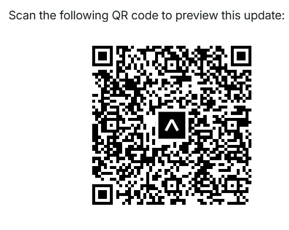

<h1>Your Safety</h1>

<strong>Your Safety</strong> is a React Native application designed to prioritize women's safety. The app enables users to share their real-time location, send emergency alerts, and access essential contact features, ensuring swift help in critical situations.

<h2>Features</h2>
<ul>
<li><strong>Share Location:</strong> Easily share your live location with your trusted contact.</li>
<li><strong>SOS Alert:</strong> Send an emergency SOS alert to your speed-dial contact with one tap.</li>
<li><strong>Real-Time Tracking:</strong> Keep your loved ones updated about your location.</li>
<li><strong>Contact Option:</strong> Quickly access a trusted contact for immediate assistance.</li>
<li><strong>Minimal and Intuitive UI:</strong> Designed with simplicity and quick access in mind.</li>
<li><strong>Customizable Settings:</strong> Add features or modify settings through the settings icon.</li>
</ul>
<h2>Purpose</h2>

The application is aimed at enhancing safety measures for women by providing tools to help them stay connected and seek help during emergencies. The intuitive interface makes it accessible for users of all technical skill levels.

<h2>Technologies Used</h2>
<ul>
<li><strong>React Native:</strong> For building the cross-platform mobile application.</li>
<li><strong>Expo:</strong> To streamline the development and testing process.</li>
<li><strong>Google Maps API:</strong> For location tracking and map rendering.</li>
</ul>
<h2>How It Works</h2>
<ol>
<li><strong>Set Up Trusted Contact:</strong> Add your emergency contact to the app.</li>
<li><strong>Share Location:</strong> Use the "Share Location" button to send your live location.</li>
<li><strong>Trigger SOS:</strong> Press the SOS button to notify your emergency contact with a predefined alert message and location.</li>
<li><strong>Locate Me:</strong> The app displays your current location on the map for quick reference.</li>
<li><strong>Settings Icon:</strong> Access app settings, contact support, or seek help via the top-right icon.</li>
</ol>
<h2>Installation and Setup</h2>

Follow these steps to set up the application:

<pre><code>git clone https://github.com/your-username/your-safety.git</code></pre>
<pre><code>cd your-safety</code></pre>
<pre><code>npm install</code></pre>
<pre><code>expo start</code></pre>
<h2>Accessing the Application</h2>

You can access the application directly by following these steps:

<ol>
<li>Download and install the <strong>Expo Go</strong> app on your smartphone from the <a href="https://play.google.com/store/apps/details?id=host.exp.exponent">Google Play Store</a> or <a href="https://apps.apple.com/us/app/expo-go/id982107779">Apple App Store</a>.</li>
<li>Open the Expo Go app on your smartphone.</li>
<li>Scan the QR code below using the scanner provided in the Expo Go app.</li>
<li>Once scanned, the application will automatically load and run on your smartphone.</li>
</ol>

Figure 4: Scan this QR Code to access the Your Safety app using Expo Go.

